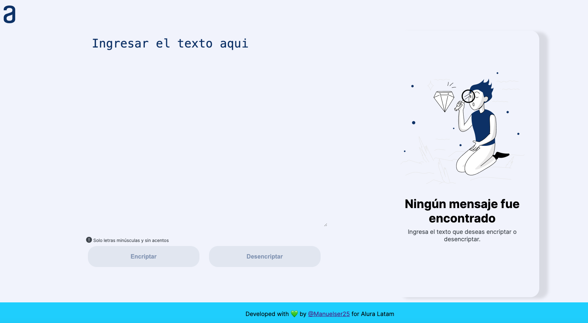

# challenger-encriptador-by-manuelser25
### ¡Bienvenidas y bienvenidos a nuestro primer desafío!
### Durante estas cuatro semanas, vamos a trabajar en una aplicación que encripta textos
### así podrás intercambiar mensajes secretos con otras personas que sepan el secreto de la encriptación utilizada.

## Descripción.
El proyecto Encriptador de texto permite cifrar palabras utilizando una técnica simple de encriptación que transforma un texto en otro. Esta diseñado con HTML, CSS y JavaScript. 

  

## Requerimientos.
- Ingresar palabras en letras minúsculas.
- No ingresar caracteres especiales ni palabras acentuadas.

## Autor
> [!NOTE]
> [Manuel Serrano](https://www.linkedin.com/in/manuel-antonio-serrano-39623274/)
